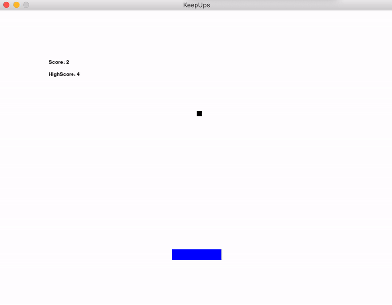

## KeepUps

I made this little project when I was just starting out with Python. It's a game, but it's no Skyrim. Or Minecraft.. Or..— it's a game!

## Demo


## Installation
The only dependency is PyGame which you can install via 
```
pip install pygame
```

## Controls 
Left arrow key to move left. Right arrow key to move up. Wait, no. Right arrow key to move right, that's it.
